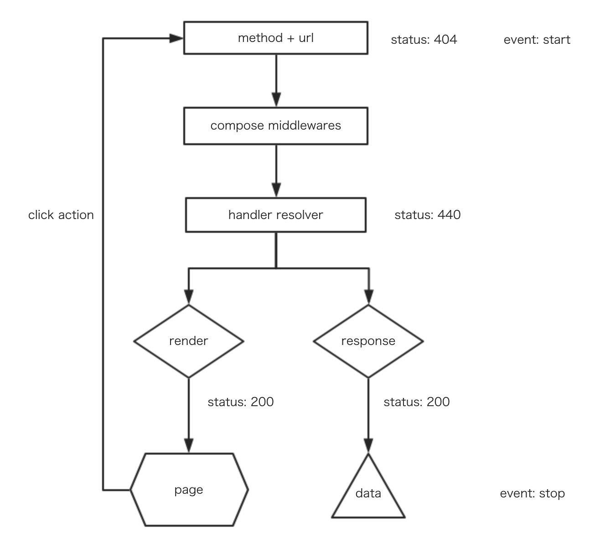

# 虚拟请求流程

虚拟请求主要模拟后端的请求在前端的表现。它既可以渲染页面，也可以获取到数据。它的运作流程如下：




虚拟请求目前分为4种：

- **@Http.Get(url)** 对应`this.ctx.get(url)`。请求数据来自`this.ctx.query`
- **@Http.Post(url)** 对应`this.ctx.post(url, data)`。请求数据分别来自`this.ctx.query`与`this.ctx.req.body`
- **@Http.Put(url)** 对应`this.ctx.put(url, data)`。请求数据分别来自`this.ctx.query`与`this.ctx.req.body`
- **@Http.Delete(url)** 对应`this.ctx.delete(url)`。请求数据来自`this.ctx.query`

虚拟请求的优势在接口的数据获取，都可以自我实现，具体接口从哪里获取，可以由虚拟请求路由的执行函数决定，解偶了传统的请求模式。

## Controller中发送虚拟请求

controller中也可以通过虚拟请求取得数据。

```javascript {3}
@Http.Get('/test')
async TestPage() {
  const data = await this.ctx.get('/api/test/value');
  await this.ctx.render(webview, {
    text: data
  })
}
```

只要能够取到`ctx`或者`app`的地方都可以使用虚拟请求。

## Vue文件中发送虚拟请求

```vue {7}
<template>
  <div></div>
</template>
<script>
export default {
  mounted() {
    this.$get('/api/test/value').then(console.log)
  }
}
</script>
```